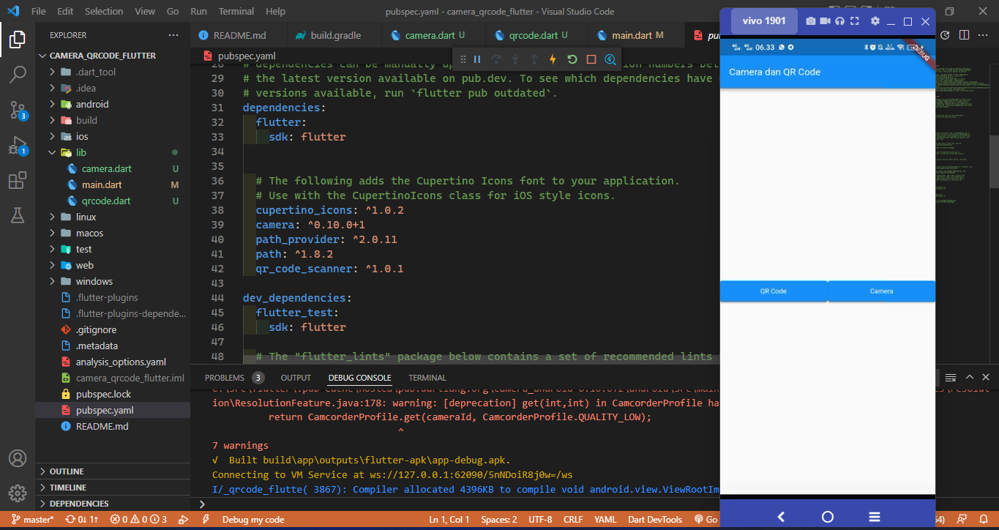
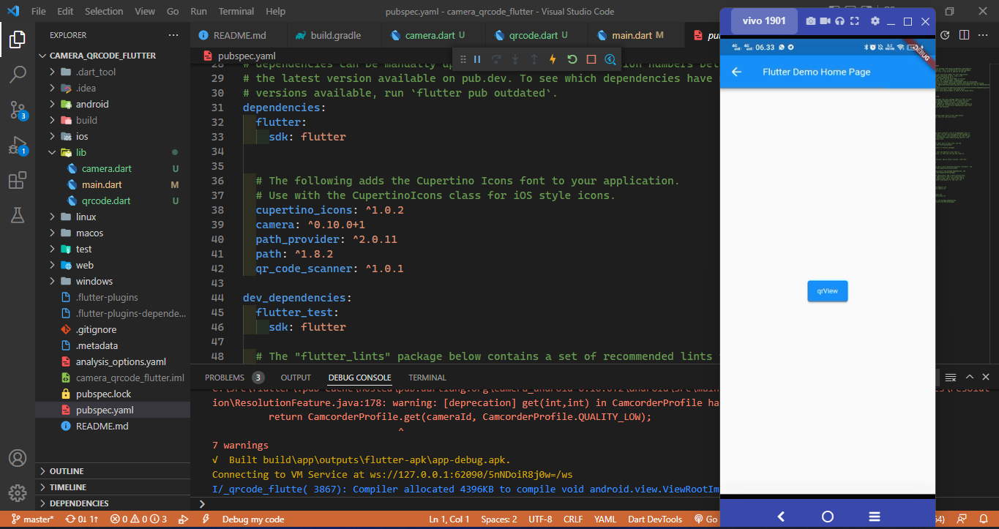
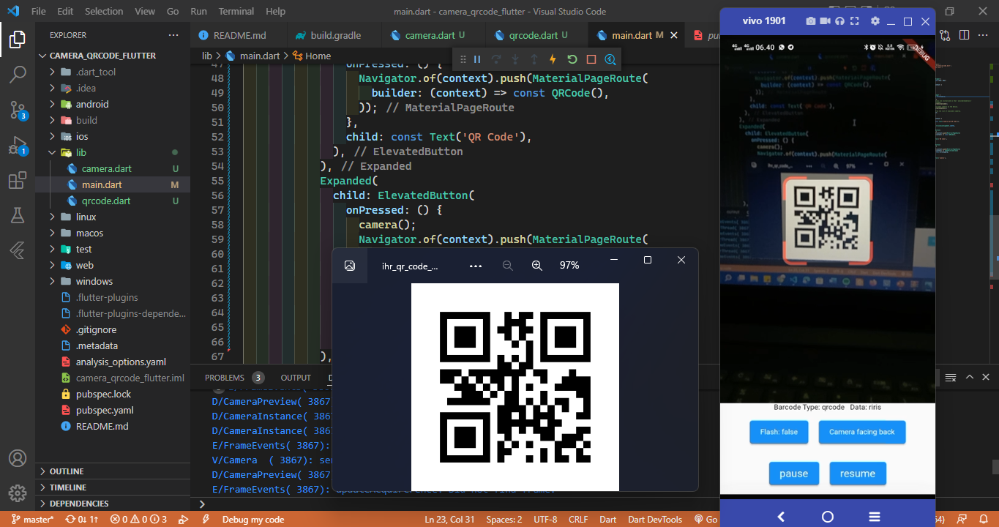
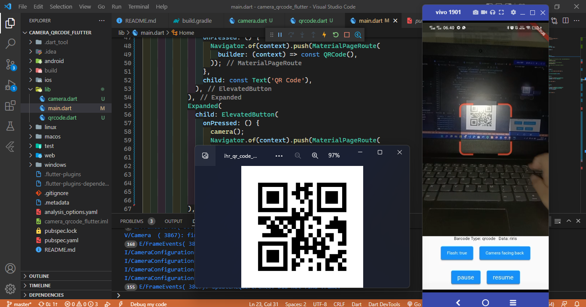
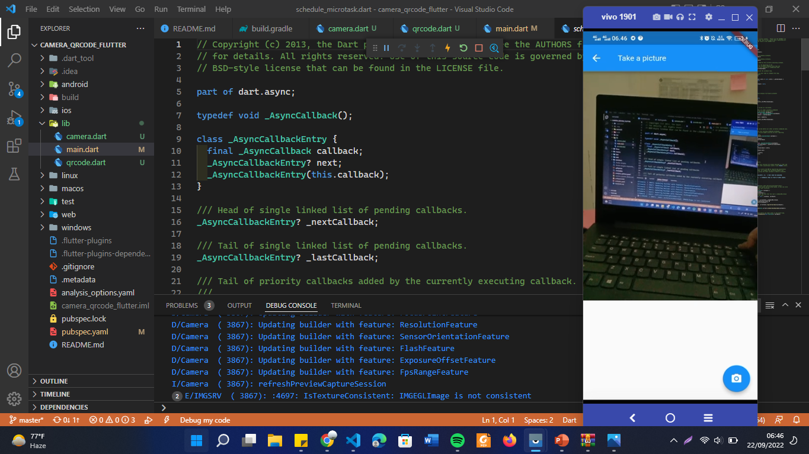
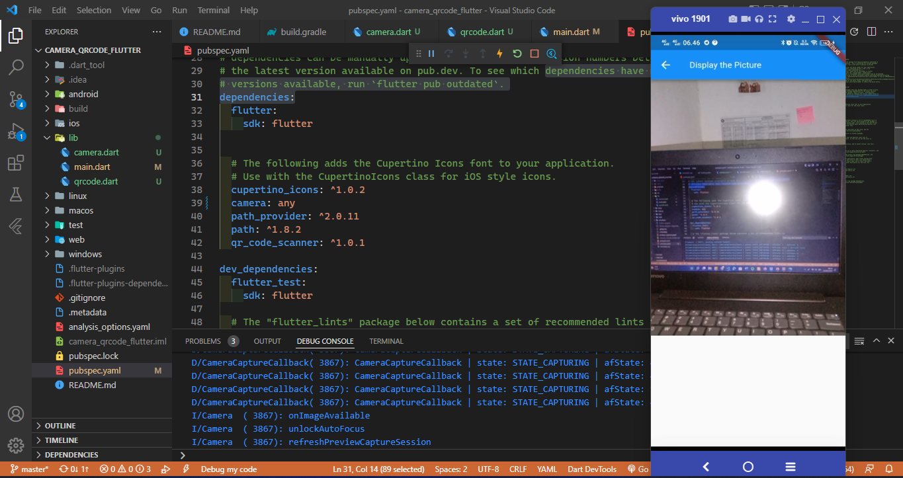

# camera_qrcode_flutter

A new Flutter project.

## Praktikum Camera Dan QR Code
- membuat project baru
- menambahkan plugin
```
flutter pub add camera
flutter pub add path_provider
flutter pub add path
flutter pub add qr_code_scanner
```
## Hasil Praktikum
Halaman Home, terdapat 2 button, yaitu QR Code dan Camera




### QR Code
Halaman QR Code, terdapat button untuk scan QR Code



* Halaman QR Code, terdapat beberapa button
    * Flash: untuk menyalakan lampu flash
    * Camera facing back: untuk mengganti kamera belakang
    * Camera facing front: untuk mengganti kamera depan
    * Pause: untuk menghentikan scan QR Code
    * Resume: untuk melanjutkan scan QR Code



### Cmera
* Halaman Camera, terdapat button untuk take foto/gambar



